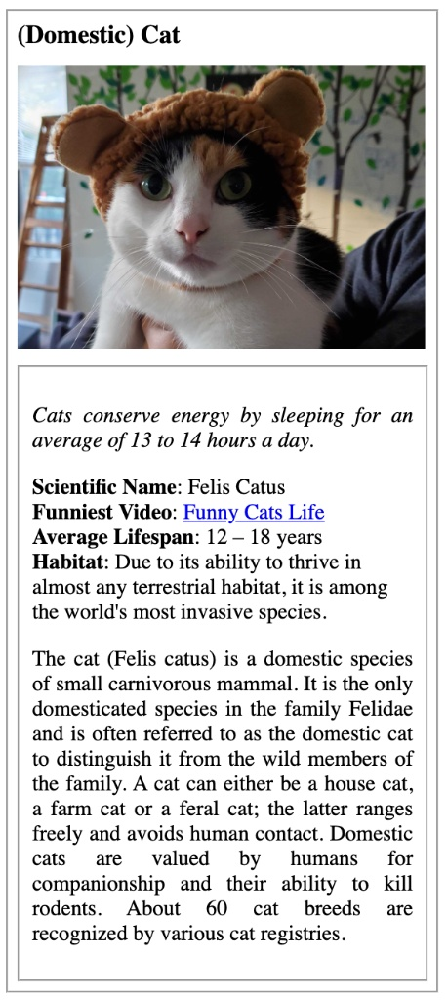
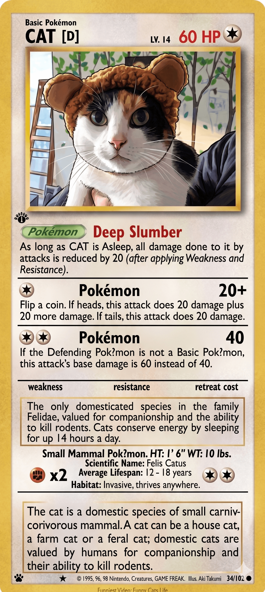

# HTML & CSS Trading Card

Companion handbook page: [Module 3 - CSS](https://ttpr-lgcc.github.io/handbook/modules/03-css)

---

## Background

Front-end developers rarely build pages from scratch with no direction. The usual
workflow is: a designer hands you a prototype, and your job is to translate it into a
real, working webpage.

In this project you'll do exactly that. You've been given a design prototype of an
animal trading card (inspired by the kind of collectible cards you might find in a
store). Your task is to write the CSS that makes the provided HTML look like the
prototype — then swap out the example animal with one of your own choosing.



---

## Objectives

By the end of this project you will be able to:

- Link an external CSS stylesheet to an HTML file
- Use CSS selectors to target elements by tag, class, and ID
- Apply the box model (margin, padding, border) to control layout and spacing
- Use Flexbox to arrange elements on a page
- Style typography (font size, weight, style, alignment)
- Read a design prototype and translate it into working code

---

## Instructions

### Setup (one time)

1. **Fork** this repository to your own GitHub account using the "Fork" button at the top right of the page.
2. **Clone** your fork to your local machine:
   ```
   git clone git@github.com:<your-username>/html-css-trading-card.git
   cd html-css-trading-card
   ```
3. Open the project folder in VS Code:
   ```
   code .
   ```
4. Open `index.html` in your browser (right-click > Open with Live Server, or open the file directly) so you can see your changes as you work.

---

### Part 1 - Swap the Animal

The HTML is already written for you. Your first job is to replace the placeholder animal content with your own.

Open `index.html` and update the following:

| Comment in the HTML                                          | What to replace it with                                                       |
| ------------------------------------------------------------ | ----------------------------------------------------------------------------- |
| `<!-- your favorite animal's name goes here -->`             | The name of your chosen animal                                                |
| `<!-- your favorite animal's image goes here -->`            | An `` tag pointing to a real photo of your animal                        |
| `<!-- your favorite animal's interesting fact goes here -->` | One interesting fact about your animal in a `<p>` tag                         |
| `<!-- your favorite animal's list items go here -->`         | At least 4 `<li>` items with stats (scientific name, lifespan, habitat, etc.) |
| `<!-- your favorite animal's description goes here -->`      | A short paragraph describing your animal                                      |

> **Tip:** Use a freely licensed image from [Wikimedia Commons](https://commons.wikimedia.org) or link to one already hosted online. Make sure to test that the image loads in the browser.

---

### Part 2 - Style with CSS

Open `style.css`. This is where all your work happens.

Your goal is to make your card look as close to the prototype as possible. Use the
image above as your visual reference at every step.

Work through the card top to bottom:

1. **Page background** - Give the `body` a light gray background color so the card stands out.
2. **Center the card** - Use Flexbox on the `body` to center the card horizontally and vertically on the page.
3. **Card container** - Give `.card-container` a white background, a visible border, a box-shadow, a fixed width, and some padding. Round the corners slightly.
4. **Card title** - Style the `h3` so it looks bold and prominent.
5. **Card image** - Make the image fill the full width of the card.
6. **Info box** - Give `.bottom-content` a border, padding, and a small margin so it is visually separated from the image.
7. **Fact paragraph** - Style the italic fact at the top of the info box.
8. **Stats list** - Remove the default bullet points. Make the label (e.g., **Scientific Name**) bold.
9. **Description paragraph** - Adjust line-height and font-size so it reads comfortably.

There is no single "correct" CSS — your card just needs to closely match the design prototype.



---

### Part 3 - Submit via Pull Request

Once your card looks the way you want it:

1. Stage and commit your changes:
   ```
   git add index.html style.css
   git commit -m "feat: add <your-animal-name> trading card"
   ```
2. Push to your fork:
   ```
   git push origin main
   ```
3. Go to **your fork** on GitHub and click **"Contribute" > "Open pull request"**.
4. Set the base repository to the original repo and base branch to `main`.
5. Give your Pull Request a descriptive title, for example:
   ```
   feat: Hessvacio - Snow Leopard trading card
   ```
6. Submit the Pull Request. Do not merge it yourself.

---

## Reflection (required)

Before submitting, create a file called `reflection.md` in the root of your project and answer these three questions:

1. Which CSS property gave you the most trouble, and how did you figure it out?
2. What is one thing you understand about CSS now that you did not understand before?
3. If you had more time, what would you change or add to your card?

Commit and push this file along with your card:

```
git add reflection.md
git commit -m "docs: add trading card reflection"
git push origin main
```

---

## Checklist

Before you submit, confirm every item below is true:

- [ ] I replaced all placeholder animal content in `index.html` with my own animal
- [ ] My animal image loads correctly in the browser
- [ ] My card has at least 4 stat list items
- [ ] My card has a fact, a stats list, and a description paragraph
- [ ] My CSS makes the card look close to the prototype
- [ ] I used Flexbox to center the card on the page
- [ ] The card has a border and a box-shadow
- [ ] I removed the default bullet points from the stats list
- [ ] I created and committed `reflection.md` with answers to all 3 questions
- [ ] I opened a Pull Request to the original repo's `main` branch

---

## Resources

- [Module 3 - CSS Handbook](https://ttpr-lgcc.github.io/handbook/modules/03-css)
- [CSS Tricks - A Complete Guide to Flexbox](https://css-tricks.com/snippets/css/a-guide-to-flexbox/)
- [MDN - Box Model](https://developer.mozilla.org/en-US/docs/Learn/CSS/Building_blocks/The_box_model)
- [MDN - CSS Selectors](https://developer.mozilla.org/en-US/docs/Web/CSS/CSS_Selectors)
- [Wikimedia Commons](https://commons.wikimedia.org) - free-to-use animal images
